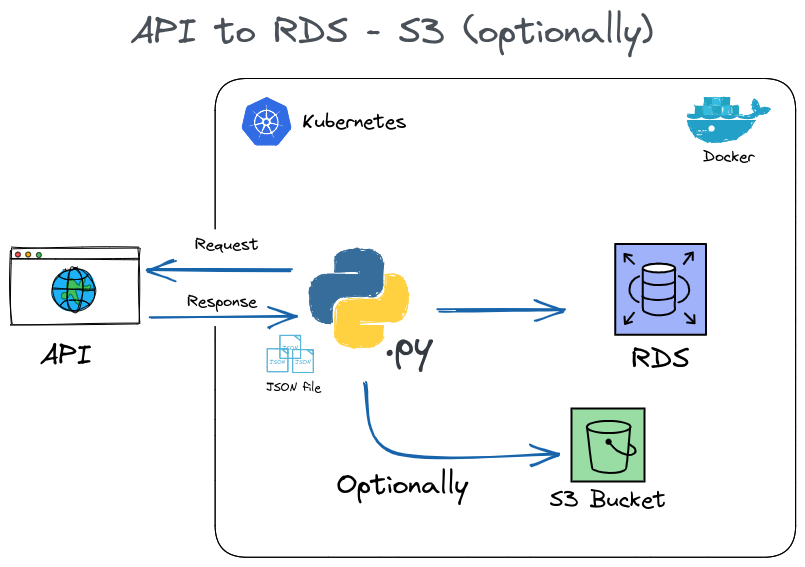

# :earth_americas:API to RDS:cloud:
### :page_with_curl:Descrição

O sistema realiza a requisição via dos dados via API, faz a transformação do arquivo JSON em dataframe e carrega no banco AWS RDS.

<b>Arquitetura</b>

### :wrench:Funcionamento

o arquivo auto.sh deleta o job de Kubernetes caso ele exista e faz o apply respectivamente

Após o apply o Kubernetes executa a imagem que instala as dependencias Python necessárias e então executa o script Python.

O script Python por sua vez contem a função que faz a requisição dos dados via API através da função fetch_api_data e depois transforma o arquivo JSON recebido em pandas dataframe. O dataframe é retornado a função main que chama a função load_data_rds, essa função conecta ao banco AWS RDS, e cria um database caso não exista e cria a tabela caso não exista, após faz a inserção dos dados na tabela e encerra a conexão.

### :clipboard: Pré requisitos
O projeto utiliza uma imagem Docker que é executada através de um job de Kubernetes, para executar o job Kuberentes será necessário um ambiente de Kubernetes em nuvem ou local, com minikube, será necessário também ter instalado e configurado  o kubectl, abaixo maiores informações do site oficial do Kubernetes.
<a href="https://kubernetes.io/pt-br/docs/tutorials/hello-minikube/">Minikube</a> 
<a href="https://kubernetes.io/pt-br/docs/tasks/tools/install-kubectl-linux/">Kubectl</a>

As bibliotecas python necessárias são instaladas previamente na imagem Docker.

 ### :rotating_light: Possiveis Problemas
  Durante a construção do projeto foi encontrado, problemas realacionados à autenticação no banco de dados AWS RDS, o erro foi solucionado usando secrets do Kubernetes um  arquivo Yaml utilizado para carregar as secrets no Kubernetes esta na pasta k8s assim como os demais scripts. 

  Obs: O arquivo auto.sh contém um comando para fazer o apply do secret.yaml, paar isso basta descomentar a linha

### :black_nib: Autores
cronstruído por Cristiano Oliveira

### :pushpin: Versão
Version: 1.0.0

### :book: Referências
 <ul>
<li><a href="https://kubernetes.io/pt-br/docs">Kubernetes</a></li>
<li><a href="https://aws.amazon.com/pt/docker/">Docker</a></li>
<li><a href="https://aws.amazon.com/pt/rds/">RDS</a></li>
<li><a href="https://olinda.bcb.gov.br/olinda/servico/PTAX/versao/v1/aplicacao#!/recursos/CotacaoMoedaDia#eyJmb3JtdWxhcmlvIjp7IiRmb3JtYXQiOiJqc29uIiwiJHRvcCI6MTAwLCJtb2VkYSI6IlVTRCIsImRhdGFDb3RhY2FvIjoiMSJ9LCJwcm9wcmllZGFkZXMiOlswLDEsMiwzLDRdfQ==">API</a></li>
  </ul>